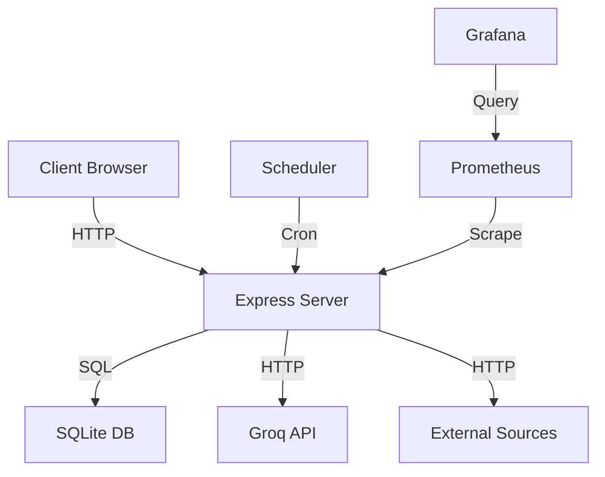

# Node.js Enterprise Observability & Developer Experience Plan v1.0

## Мета
Створити систему, яка **сама звітує про своє здоров'я**, не потребує ручних перевірок, і дає **вимірювані факти** для прийняття рішень.

## Принципи
1. **No Manual Checks** — жодних `console.log` для дебагу
2. **Facts, Not Feelings** — метрики, не інтуїція
3. **Fail Fast, Fail Loud** — якщо щось не так, система кричить одразу
4. **Self-Documenting** — код пояснює себе сам через структуру

---

## Фаза 1: Startup Diagnostics (При старті системи)

### 1.1 Dependency Verification
**Що перевіряємо:**
- Всі npm пакети встановлені (package.json vs node_modules)
- Версії критичних залежностей відповідають expectations
- Native modules скомпілювались успішно

**Код:**
```javascript
// src/diagnostics/dependencies.js
const fs = require('fs');
const path = require('path');

function verifyDependencies() {
  const pkg = JSON.parse(fs.readFileSync('package.json', 'utf8'));
  const required = Object.keys(pkg.dependencies || {});

  const missing = required.filter(dep => {
    try {
      require.resolve(dep);
      return false;
    } catch {
      return true;
    }
  });

  if (missing.length > 0) {
    throw new Error(`MISSING DEPS: ${missing.join(', ')}. Run: npm install`);
  }

  return { total: required.length, missing: 0, status: 'OK' };
}
```

**Acceptance Criteria:**
- [ ] При відсутньому пакеті процес завершується з кодом 1 та зрозумілою помилкою
- [ ] При наявності всіх пакетів — повертає `{ status: 'OK', total: N }`

### 1.2 Environment Validation
**Що перевіряємо:**
- Всі обов'язкові env variables присутні
- Формат env variables валідний (URL, числа, regex)
- Немає конфліктів між env variables

**Код:**
```javascript
// src/diagnostics/environment.js
const Joi = require('joi');

const envSchema = Joi.object({
  NODE_ENV: Joi.string().valid('development', 'production', 'test').default('development'),
  PORT: Joi.number().port().default(3000),
  DB_PATH: Joi.string().required(),
  GROQ_API_KEY: Joi.string().when('NODE_ENV', {
    is: 'production',
    then: Joi.required(),
    otherwise: Joi.optional()
  }),
  LOG_LEVEL: Joi.string().valid('debug', 'info', 'warn', 'error').default('info'),
}).unknown();

function validateEnvironment() {
  const { error, value } = envSchema.validate(process.env, { abortEarly: false });

  if (error) {
    const missing = error.details.map(d => d.path[0]);
    throw new Error(`ENV VALIDATION FAILED: ${missing.join(', ')}`);
  }

  return { status: 'OK', env: value.NODE_ENV, port: value.PORT };
}
```

**Acceptance Criteria:**
- [ ] При відсутньому `DB_PATH` — процес не стартує, зрозуміла помилка
- [ ] При валідних env — повертає об'єкт з розпарсеними значеннями
- [ ] В production `GROQ_API_KEY` обов'язковий

### 1.3 Database Connectivity & Schema
**Що перевіряємо:**
- Підключення до БД успішне
- Всі необхідні таблиці існують
- Міграції актуальні
- Індекси створені

**Код:**
```javascript
// src/diagnostics/database.js
function verifyDatabase(db) {
  const checks = {
    connection: false,
    tables: [],
    missingTables: [],
    migrations: { current: 0, latest: 0 },
  };

  try {
    // Test connection
    db.prepare('SELECT 1').get();
    checks.connection = true;

    // Check tables
    const requiredTables = ['items', 'chunks', 'profiles', 'migrations'];
    const existing = db.prepare(
      "SELECT name FROM sqlite_master WHERE type='table'"
    ).all().map(r => r.name);

    checks.tables = existing;
    checks.missingTables = requiredTables.filter(t => !existing.includes(t));

    // Check migrations
    const migrationCount = db.prepare('SELECT COUNT(*) as count FROM migrations').get();
    checks.migrations.current = migrationCount?.count || 0;
    checks.migrations.latest = fs.readdirSync('./migrations').length;

    if (checks.missingTables.length > 0) {
      throw new Error(`MISSING TABLES: ${checks.missingTables.join(', ')}`);
    }

    if (checks.migrations.current < checks.migrations.latest) {
      throw new Error(`MIGRATIONS PENDING: ${checks.migrations.current}/${checks.migrations.latest}`);
    }

    return { ...checks, status: 'OK' };
  } catch (err) {
    throw new Error(`DB CHECK FAILED: ${err.message}`);
  }
}
```

**Acceptance Criteria:**
- [ ] При відсутній таблиці — процес не стартує
- [ ] При pending міграціях — процес не стартує з підказкою `npm run migrate`
- [ ] При успіху — повертає список всіх таблиць та версію міграцій

### 1.4 External Services Health
**Що перевіряємо:**
- Всі зовнішні API доступні
- API keys валідні (тестовий запит)
- Rate limits не перевищені

**Код:**
```javascript
// src/diagnostics/external.js
async function checkExternalServices() {
  const services = {
    groq: { url: 'https://api.groq.com/openai/v1/models', key: process.env.GROQ_API_KEY },
    // Додати інші сервіси
  };

  const results = {};

  for (const [name, config] of Object.entries(services)) {
    try {
      const res = await fetch(config.url, {
        headers: config.key ? { 'Authorization': `Bearer ${config.key}` } : {}
      });

      results[name] = {
        status: res.ok ? 'reachable' : 'unreachable',
        statusCode: res.status,
        latency: Date.now() - start,
      };
    } catch (err) {
      results[name] = { status: 'error', error: err.message };
    }
  }

  return results;
}
```

**Acceptance Criteria:**
- [ ] При недоступному Groq API — warning, але процес стартує (graceful degradation)
- [ ] При невалідному API key — clear error з інструкцією
- [ ] Латенсі кожного сервісу логується

### 1.5 Module Readiness
**Що перевіряємо:**
- Кожен core module завантажується без помилок
- Кожен module експортує очікуваний інтерфейс
- Немає циклічних залежностей

**Код:**
```javascript
// src/diagnostics/modules.js
const MODULES = [
  { name: 'search-engine', required: true, exports: ['findRelevant', 'generateEmbedding'] },
  { name: 'profile-generator', required: true, exports: ['fromText', 'loadProfile'] },
  { name: 'db', required: true, exports: ['getItem', 'insertItem'] },
  { name: 'reranker', required: false, exports: ['rerank'] },
  { name: 'explainer', required: false, exports: ['explain'] },
];

function verifyModules() {
  const results = [];

  for (const mod of MODULES) {
    try {
      const instance = require(`../${mod.name}`);
      const missing = mod.exports.filter(exp => !instance[exp]);

      results.push({
        name: mod.name,
        loaded: true,
        exports: { expected: mod.exports, missing },
        required: mod.required,
        status: missing.length === 0 ? 'OK' : 'MISSING_EXPORTS',
      });
    } catch (err) {
      results.push({
        name: mod.name,
        loaded: false,
        error: err.message,
        required: mod.required,
        status: 'FAILED',
      });

      if (mod.required) {
        throw new Error(`CRITICAL MODULE FAILED: ${mod.name} — ${err.message}`);
      }
    }
  }

  return results;
}
```

**Acceptance Criteria:**
- [ ] При відсутньому required модулі — процес не стартує
- [ ] При відсутньому optional модулі — warning, продовжуємо
- [ ] При missing exports — clear error зі списком чого бракує

### 1.6 Startup Report
**Що робимо:**
- Агрегуємо всі перевірки в один звіт
- Виводимо в stdout як structured JSON
- Зберігаємо в пам'ять для health endpoint

**Код:**
```javascript
// src/diagnostics/index.js
async function runStartupDiagnostics() {
  const startTime = Date.now();

  const report = {
    timestamp: new Date().toISOString(),
    version: process.env.npm_package_version,
    node: process.version,
    checks: {},
    status: 'healthy',
  };

  try {
    report.checks.dependencies = verifyDependencies();
    report.checks.environment = validateEnvironment();
    report.checks.database = verifyDatabase(db);
    report.checks.external = await checkExternalServices();
    report.checks.modules = verifyModules();

    // Aggregate status
    const allOk = Object.values(report.checks).every(c => 
      c.status === 'OK' || c.status === 'reachable' || Array.isArray(c)
    );

    report.status = allOk ? 'healthy' : 'degraded';
    report.duration = Date.now() - startTime;

    // Output as structured log
    console.log(JSON.stringify({
      level: 'info',
      msg: 'Startup diagnostics complete',
      report,
    }));

    return report;
  } catch (err) {
    report.status = 'unhealthy';
    report.error = err.message;
    report.duration = Date.now() - startTime;

    console.error(JSON.stringify({
      level: 'fatal',
      msg: 'Startup diagnostics failed',
      report,
    }));

    process.exit(1);
  }
}
```

**Acceptance Criteria:**
- [ ] При успіху — виводить JSON зі статусом healthy та всіма checks
- [ ] При провалі — виводить JSON зі статусом unhealthy та конкретною помилкою
- [ ] Тривалість кожного check логується

---

## Фаза 2: Runtime Health Checks (Під час роботи)

### 2.1 Health Endpoint
**Що робимо:**
- HTTP endpoint `/health` для external monitors
- Kubernetes/Docker використовують для readiness/liveness

**Код:**
```javascript
// src/routes/health.js
app.get('/health', (req, res) => {
  const status = {
    status: 'healthy',
    timestamp: new Date().toISOString(),
    uptime: process.uptime(),
    version: process.env.npm_package_version,
    checks: {
      db: db.isConnected() ? 'connected' : 'disconnected',
      memory: process.memoryUsage(),
      cpu: process.cpuUsage(),
    },
  };

  const isHealthy = status.checks.db === 'connected';
  res.status(isHealthy ? 200 : 503).json(status);
});
```

**Acceptance Criteria:**
- [ ] Returns 200 when all checks pass
- [ ] Returns 503 when any critical check fails
- [ ] Response time < 100ms

### 2.2 Readiness vs Liveness
**Readiness** — чи готовий приймати трафік?
**Liveness** — чи не завис?

**Код:**
```javascript
// Readiness — чи готовий до роботи
app.get('/ready', (req, res) => {
  const ready = startupReport?.status === 'healthy' && db.isConnected();
  res.status(ready ? 200 : 503).json({ ready });
});

// Liveness — чи не deadlocked
app.get('/alive', (req, res) => {
  const alive = Date.now() - lastActivity < 30000; // 30s timeout
  res.status(alive ? 200 : 503).json({ alive });
});
```

**Acceptance Criteria:**
- [ ] `/ready` повертає 503 поки startup diagnostics не завершаться
- [ ] `/alive` повертає 503 якщо event loop заблокований > 30s

### 2.3 Deep Health Check
**Що робимо:**
- Перевіряємо не тільки підключення, а й функціональність
- Тестовий запит через весь pipeline

**Код:**
```javascript
app.get('/health/deep', async (req, res) => {
  const checks = {
    db: await testDatabaseQuery(),
    search: await testSearchEngine(),
    external: await testExternalAPI(),
  };

  const allOk = Object.values(checks).every(c => c.status === 'OK');
  res.status(allOk ? 200 : 503).json({ checks });
});
```

**Acceptance Criteria:**
- [ ] Тестовий search query проходить через весь pipeline
- [ ] Якщо search падає — clear error з місцем падіння
- [ ] Не перевантажує систему (lightweight checks)

---

## Фаза 3: Structured Logging (Структуроване логування)

### 3.1 JSON Format
**Що робимо:**
- Всі логи в JSON для машинної обробки
- Рівні: debug, info, warn, error, fatal

**Код:**
```javascript
// src/logger.js
const pino = require('pino');

const logger = pino({
  level: process.env.LOG_LEVEL || 'info',
  formatters: {
    level: (label) => ({ level: label }),
  },
  base: {
    pid: process.pid,
    node: process.version,
  },
});

// Usage
logger.info({ component: 'search-engine', operation: 'findRelevant', duration: 320 }, 'Search complete');
logger.error({ err, component: 'db', operation: 'insert' }, 'DB write failed');
```

**Acceptance Criteria:**
- [ ] Кожен log entry — валідний JSON
- [ ] Поля: level, msg, timestamp, component, operation
- [ ] Errors включають stack trace

### 3.2 Request Context
**Що робимо:**
- Кожен request має unique ID
- Всі логи в рамках request — з цим ID

**Код:**
```javascript
// src/middleware/request-context.js
const { v4: uuidv4 } = require('uuid');

function requestContext(req, res, next) {
  req.id = req.headers['x-request-id'] || uuidv4();
  req.log = logger.child({ requestId: req.id });

  req.log.info({ method: req.method, path: req.path }, 'Request started');

  res.on('finish', () => {
    req.log.info({ statusCode: res.statusCode, duration: Date.now() - req.startTime }, 'Request completed');
  });

  next();
}
```

**Acceptance Criteria:**
- [ ] Кожен request має `x-request-id` в headers
- [ ] Всі логи в рамках request — з однаковим requestId
- [ ] Можна простежити повний lifecycle request за ID

### 3.3 Business Events
**Що робимо:**
- Логуємо бізнес-події, не тільки технічні
- Користувач зробив пошук, схвалив результат, etc.

**Код:**
```javascript
// Business event
logger.info({
  event: 'search.completed',
  user: req.user?.id,
  query: req.body.query,
  resultsCount: results.length,
  duration: searchDuration,
  mode: req.body.mode,
}, 'User performed search');
```

**Acceptance Criteria:**
- [ ] Кожна бізнес-операція логується як event
- [ ] Events можна агрегувати (скільки пошуків за день)
- [ ] Events включають context для аналітики

---

## Фаза 4: Metrics (Прометей/Графана)

### 4.1 Application Metrics
**Що робимо:**
- Збираємо метрики в форматі Prometheus
- Endpoint `/metrics` для scraping

**Код:**
```javascript
// src/metrics.js
const promClient = require('prom-client');

const httpRequestDuration = new promClient.Histogram({
  name: 'http_request_duration_seconds',
  help: 'Duration of HTTP requests in seconds',
  labelNames: ['method', 'route', 'status_code'],
  buckets: [0.1, 0.5, 1, 2, 5, 10],
});

const searchDuration = new promClient.Histogram({
  name: 'search_duration_seconds',
  help: 'Search operation duration',
  labelNames: ['mode', 'status'],
});

const dbQueryDuration = new promClient.Histogram({
  name: 'db_query_duration_seconds',
  help: 'Database query duration',
  labelNames: ['operation', 'table'],
});

app.get('/metrics', (req, res) => {
  res.set('Content-Type', promClient.register.contentType);
  res.end(promClient.register.metrics());
});
```

**Acceptance Criteria:**
- [ ] `/metrics` повертає валідний Prometheus format
- [ ] Кожен HTTP request — duration histogram
- [ ] Кожна DB query — duration histogram
- [ ] Кожен search — duration + mode label

### 4.2 Business Metrics
**Що робимо:**
- Метрики бізнес-подій

**Код:**
```javascript
const searchesTotal = new promClient.Counter({
  name: 'searches_total',
  help: 'Total number of searches',
  labelNames: ['mode', 'status'],
});

const itemsProcessed = new promClient.Counter({
  name: 'items_processed_total',
  help: 'Total items processed',
  labelNames: ['source', 'status'],
});
```

**Acceptance Criteria:**
- [ ] Можна побудувати dashboard: searches per hour, success rate
- [ ] Можна порівняти sequential vs parallel mode performance
- [ ] Alerts на аномалії (раптове падіння searches)

---

## Фаза 5: Error Handling & Recovery

### 5.1 Error Classification
**Що робимо:**
- Кожна помилка має код, статус, severity, recovery action

**Код:**
```javascript
// src/errors.js
class AppError extends Error {
  constructor(message, code, statusCode = 500, severity = 'error', recoverable = false) {
    super(message);
    this.code = code;
    this.statusCode = statusCode;
    this.severity = severity;
    this.recoverable = recoverable;
    this.timestamp = new Date().toISOString();
  }
}

const ErrorCodes = {
  DB_CONNECTION_LOST: { status: 503, severity: 'critical', recoverable: true },
  SEARCH_ENGINE_FAILED: { status: 500, severity: 'error', recoverable: false },
  EXTERNAL_API_TIMEOUT: { status: 504, severity: 'warning', recoverable: true },
  VALIDATION_FAILED: { status: 400, severity: 'info', recoverable: true },
};
```

**Acceptance Criteria:**
- [ ] Кожна помилка має унікальний код
- [ ] Severity визначає alerting (critical → pager, warning → slack)
- [ ] Recoverable визначає retry policy

### 5.2 Circuit Breaker
**Що робимо:**
- Автоматичний вимикач для зовнішніх сервісів

**Код:**
```javascript
// src/circuit-breaker.js
class CircuitBreaker {
  constructor(name, options = {}) {
    this.name = name;
    this.failureThreshold = options.failureThreshold || 5;
    this.resetTimeout = options.resetTimeout || 30000;
    this.state = 'CLOSED'; // CLOSED, OPEN, HALF_OPEN
    this.failures = 0;
    this.lastFailure = null;
  }

  async execute(fn) {
    if (this.state === 'OPEN') {
      if (Date.now() - this.lastFailure > this.resetTimeout) {
        this.state = 'HALF_OPEN';
      } else {
        throw new AppError(
          `Circuit OPEN for ${this.name}`,
          'CIRCUIT_OPEN',
          503,
          'warning',
          true
        );
      }
    }

    try {
      const result = await fn();
      this.onSuccess();
      return result;
    } catch (err) {
      this.onFailure();
      throw err;
    }
  }

  onSuccess() {
    this.failures = 0;
    this.state = 'CLOSED';
  }

  onFailure() {
    this.failures++;
    this.lastFailure = Date.now();

    if (this.failures >= this.failureThreshold) {
      this.state = 'OPEN';
      logger.warn({ breaker: this.name, failures: this.failures }, 'Circuit OPEN');
    }
  }
}
```

**Acceptance Criteria:**
- [ ] Після 5 failures — circuit відкривається
- [ ] Через 30s — half-open, тестовий запит
- [ ] При успіху в half-open — circuit закривається
- [ ] Метрики: circuit_state, circuit_failures_total

### 5.3 Graceful Degradation
**Що робимо:**
- Якщо фіча недоступна — працюємо без неї

**Код:**
```javascript
// Search without AI reranker
async function search(query, options) {
  const results = await bm25Search(query);

  if (options.useReranker && circuitBreaker.isClosed('groq')) {
    try {
      return await reranker.rerank(results, query);
    } catch {
      logger.warn('Reranker failed, returning raw results');
      return results;
    }
  }

  return results;
}
```

**Acceptance Criteria:**
- [ ] При недоступному Groq — search працює без reranker
- [ ] При недоступній БД — повертає кешовані результати (якщо є)
- [ ] Користувач бачить warning, але не помилку

---

## Фаза 6: Distributed Tracing

### 6.1 Request Tracing
**Що робимо:**
- Кожен request — trace з spans
- Можна побачити де саме затримка

**Код:**
```javascript
// src/tracing.js
const { NodeSDK } = require('@opentelemetry/sdk-node');
const { JaegerExporter } = require('@opentelemetry/exporter-jaeger');

const sdk = new NodeSDK({
  traceExporter: new JaegerExporter({ endpoint: 'http://jaeger:14268/api/traces' }),
  serviceName: 'semantic-search',
});

sdk.start();

// Usage in route
app.get('/api/search', async (req, res) => {
  const span = tracer.startSpan('search');

  try {
    const profileSpan = tracer.startSpan('generate-profile', { parent: span });
    const profile = await generateProfile(req.body.query);
    profileSpan.end();

    const searchSpan = tracer.startSpan('execute-search', { parent: span });
    const results = await searchEngine.findRelevant(profile);
    searchSpan.end();

    res.json(results);
  } finally {
    span.end();
  }
});
```

**Acceptance Criteria:**
- [ ] Кожен request — trace в Jaeger/Zipkin
- [ ] Кожна операція — span з duration
- [ ] Можна знайти повільний span (наприклад, generateEmbedding)

---

## Фаза 7: Alerting & Runbooks

### 7.1 Alert Rules
**Що робимо:**
- Автоматичні alerts на аномалії

**Приклади:**
```yaml
# alerts.yml
- alert: HighErrorRate
  expr: rate(http_requests_total{status=~"5.."}[5m]) > 0.1
  for: 2m
  labels:
    severity: critical
  annotations:
    summary: "High error rate detected"
    runbook_url: "https://wiki/runbooks/high-error-rate"

- alert: SearchLatencyHigh
  expr: histogram_quantile(0.95, search_duration_seconds) > 5
  for: 5m
  labels:
    severity: warning
  annotations:
    summary: "Search latency > 5s"
    runbook_url: "https://wiki/runbooks/search-latency"
```

**Acceptance Criteria:**
- [ ] Alert спрацьовує при error rate > 10%
- [ ] Alert спрацьовує при p95 latency > 5s
- [ ] Кожен alert має runbook — покрокова інструкція

### 7.2 Runbooks
**Що робимо:**
- Документи: як діагностувати і фіксити кожну проблему

**Приклад:**
```markdown
# Runbook: Search Returns Empty Results

## Symptoms
- /api/search returns `{ results: [] }`
- No errors in logs

## Diagnosis
1. Check /health — DB connected?
2. Check /metrics — chunks_total > 0?
3. Check logs for "chunksSearch" — what keywords?

## Resolution
1. If chunks_total == 0: Run POST /api/rechunk or POST /api/sync
2. If keywords don't match: Check profile.keywords in request
3. If threshold too high: Lower threshold in request
```

**Acceptance Criteria:**
- [ ] Кожен alert має runbook
- [ ] Runbook включає diagnosis steps
- [ ] Runbook включає resolution steps

---

## Фаза 8: Frontend Observability

### 8.1 Error Boundaries
**Що робимо:**
- React ловить помилки, не падає білим екраном

**Код:**
```jsx
// client/src/components/ErrorBoundary.jsx
class ErrorBoundary extends React.Component {
  constructor(props) {
    super(props);
    this.state = { hasError: false, error: null };
  }

  static getDerivedStateFromError(error) {
    return { hasError: true, error };
  }

  componentDidCatch(error, errorInfo) {
    // Send to backend
    fetch('/api/client-error', {
      method: 'POST',
      body: JSON.stringify({
        error: error.message,
        stack: error.stack,
        componentStack: errorInfo.componentStack,
        url: window.location.href,
        userAgent: navigator.userAgent,
      }),
    });
  }

  render() {
    if (this.state.hasError) {
      return (
        <div className="error-fallback">
          <h2>⚠️ Something went wrong</h2>
          <p>Error: {this.state.error.message}</p>
          <button onClick={() => window.location.reload()}>Reload</button>
          <pre>{this.state.error.stack}</pre>
        </div>
      );
    }
    return this.props.children;
  }
}
```

**Acceptance Criteria:**
- [ ] При JS error — UI показує fallback, не білий екран
- [ ] Error відправляється на бекенд
- [ ] Можна скопіювати error ID для support

### 8.2 Frontend Metrics
**Що робимо:**
- Збираємо метрики з браузера

**Код:**
```javascript
// Web Vitals
import { getCLS, getFID, getFCP, getLCP, getTTFB } from 'web-vitals';

function sendToAnalytics(metric) {
  fetch('/api/metrics/frontend', {
    method: 'POST',
    body: JSON.stringify({
      name: metric.name,
      value: metric.value,
      id: metric.id,
    }),
  });
}

getCLS(sendToAnalytics);
getFID(sendToAnalytics);
getLCP(sendToAnalytics);
```

**Acceptance Criteria:**
- [ ] LCP (Largest Contentful Paint) < 2.5s
- [ ] FID (First Input Delay) < 100ms
- [ ] CLS (Cumulative Layout Shift) < 0.1

---

## Фаза 9: Testing Observability

### 9.1 Test Reports
**Що робимо:**
- Кожен тест — structured report

**Код:**
```javascript
// jest.config.js
module.exports = {
  reporters: [
    'default',
    ['jest-junit', {
      outputDirectory: './reports',
      outputName: 'junit.xml',
    }],
    ['jest-html-reporter', {
      pageTitle: 'Test Report',
      outputPath: './reports/test-report.html',
    }],
  ],
};
```

**Acceptance Criteria:**
- [ ] HTML report з coverage, duration, failed tests
- [ ] JUnit XML для CI integration
- [ ] Screenshot при failed e2e test

### 9.2 Contract Testing
**Що робимо:**
- Перевіряємо що API не зламав фронтенд

**Код:**
```javascript
// tests/contract/api-contract.test.js
describe('API Contract', () => {
  it('POST /api/search returns expected shape', async () => {
    const res = await request(app)
      .post('/api/search')
      .send({ query: 'test' });

    expect(res.body).toMatchSchema({
      results: Joi.array().items({
        id: Joi.string().required(),
        score: Joi.number().required(),
        content: Joi.string().required(),
      }),
      stats: Joi.object().required(),
    });
  });
});
```

**Acceptance Criteria:**
- [ ] Кожен API endpoint — contract test
- [ ] При зміні response shape — тест падає
- [ ] Фронтенд не зламається через API зміни

---

## Фаза 10: Documentation & Onboarding

### 10.1 System Diagram
**Що робимо:**
- Mermaid/C4 diagram в README



### 10.2 API Documentation
**Що робимо:**
- OpenAPI/Swagger spec

**Код:**
```javascript
// src/routes/swagger.js
const swaggerUi = require('swagger-ui-express');
const swaggerDocument = require('./swagger.json');

app.use('/api-docs', swaggerUi.serve, swaggerUi.setup(swaggerDocument));
```

**Acceptance Criteria:**
- [ ] Кожен endpoint задокументований
- [ ] Приклади request/response
- [ ] Можна тестувати прямо в /api-docs

### 10.3 Runbook Index
**Що робимо:**
- Єдиний індекс всіх runbooks

```markdown
# Runbooks Index

| Alert | Symptoms | Runbook |
|-------|----------|---------|
| HighErrorRate | 5xx > 10% | [runbooks/high-error-rate.md](...) |
| SearchLatencyHigh | p95 > 5s | [runbooks/search-latency.md](...) |
| DBConnectionLost | /health returns 503 | [runbooks/db-connection.md](...) |
```

---

## Production-Ready Checklist

| # | Item | Фаза | Priority |
|---|------|------|----------|
| 1 | Startup diagnostics | 1 | Critical |
| 2 | Health endpoints | 2 | Critical |
| 3 | Structured logging | 3 | Critical |
| 4 | Metrics (Prometheus) | 4 | High |
| 5 | Error classification | 5 | Critical |
| 6 | Circuit breaker | 5 | High |
| 7 | Request tracing | 6 | Medium |
| 8 | Alerting rules | 7 | High |
| 9 | Runbooks | 7 | High |
| 10 | Frontend error boundaries | 8 | Critical |
| 11 | Frontend metrics | 8 | Medium |
| 12 | Test reports | 9 | Medium |
| 13 | Contract tests | 9 | High |
| 14 | API documentation | 10 | Medium |
| 15 | System diagrams | 10 | Low |

---

## Верифікація (Як перевірити що план реалізований)

### Manual Verification
```bash
# 1. Startup diagnostics
curl http://localhost:3000/health
# Expected: JSON with status, checks, timestamp

# 2. Metrics
curl http://localhost:3000/metrics
# Expected: Prometheus format, http_request_duration_seconds present

# 3. Deep health
curl http://localhost:3000/health/deep
# Expected: All checks pass, search test works

# 4. Error handling
curl -X POST http://localhost:3000/api/search -d '{}'
# Expected: 400 with error code and message

# 5. Frontend error boundary
# Open DevTools, викликати помилку в консолі
# Expected: Error fallback UI, error sent to /api/client-error
```

### Automated Verification
```bash
# Run all checks
npm run verify

# Expected output:
# ✅ Startup diagnostics: PASS
# ✅ Health endpoint: PASS
# ✅ Metrics endpoint: PASS
# ✅ Deep health: PASS
# ✅ Error handling: PASS
# ✅ Frontend: PASS
# 
# System ready for production
```

---

## Приклад повного startup output

```json
{
  "level": "info",
  "msg": "Startup diagnostics complete",
  "timestamp": "2026-05-12T20:00:00Z",
  "report": {
    "version": "6.1.0",
    "node": "v20.12.0",
    "status": "healthy",
    "duration": 2345,
    "checks": {
      "dependencies": { "status": "OK", "total": 45, "missing": 0 },
      "environment": { "status": "OK", "env": "production", "port": 3000 },
      "database": { 
        "status": "OK", 
        "tables": ["items", "chunks", "profiles", "migrations"],
        "migrations": { "current": 6, "latest": 6 }
      },
      "external": {
        "groq": { "status": "reachable", "latency": 120 }
      },
      "modules": [
        { "name": "search-engine", "status": "OK", "exports": ["findRelevant", "generateEmbedding"] },
        { "name": "profile-generator", "status": "OK", "exports": ["fromText", "loadProfile"] },
        { "name": "reranker", "status": "OK", "exports": ["rerank"] },
        { "name": "explainer", "status": "OK", "exports": ["explain"] }
      ]
    }
  }
}
```

---

## Приклад runtime error

```json
{
  "level": "error",
  "msg": "Search operation failed",
  "timestamp": "2026-05-12T20:05:00Z",
  "requestId": "req_abc123",
  "error": {
    "code": "SEARCH_ENGINE_FAILED",
    "message": "Embedding generation failed",
    "statusCode": 500,
    "severity": "error",
    "recoverable": false,
    "component": "search-engine",
    "operation": "generateEmbedding",
    "stack": "Error: Package subpath...",
    "fix": "Update import to '@huggingface/transformers'"
  },
  "context": {
    "query": "nodejs developer",
    "mode": "sequential",
    "user": "user_123"
  }
}
```

---

## Summary

Цей план дає:
1. **Facts** — вимірювані метрики, не інтуїція
2. **Automation** — система сама звітує, не ручні перевірки
3. **Resilience** — graceful degradation, circuit breakers
4. **Visibility** — traces, logs, metrics в одному місці
5. **Actionable errors** — кожна помилка має код, severity, fix

**Senior Dev** бачить: архітектура здорова, можна рухатись далі.
**Tech Lead** бачить: система автономна, не потребує постійного догляду.
**AI/Auto** бачить: чіткі acceptance criteria, можна генерувати код пункт за пунктом.
